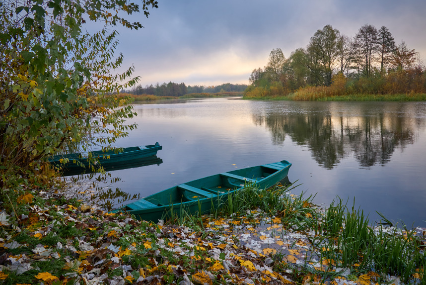
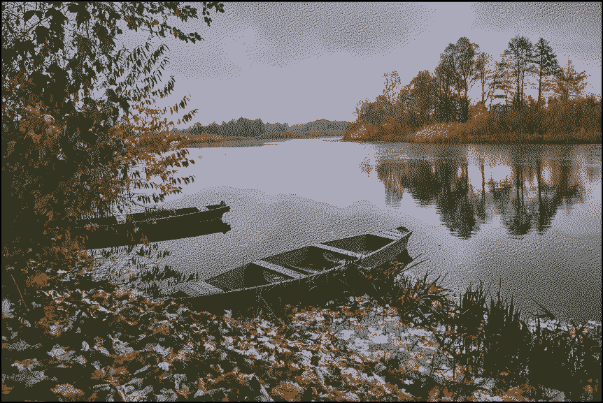
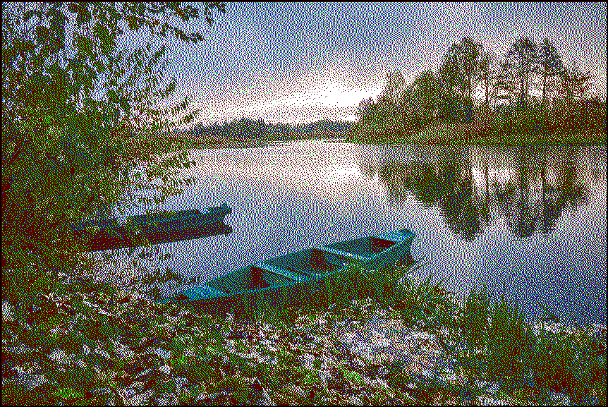
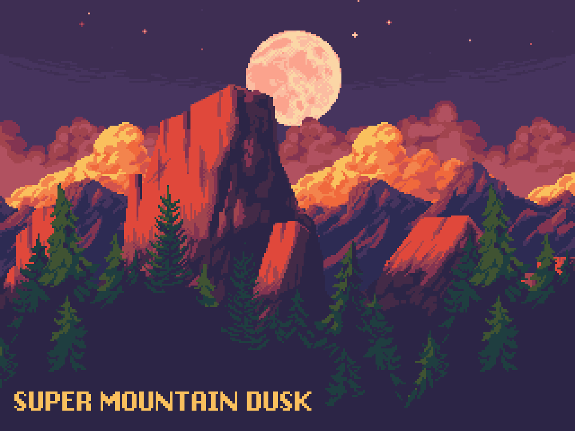
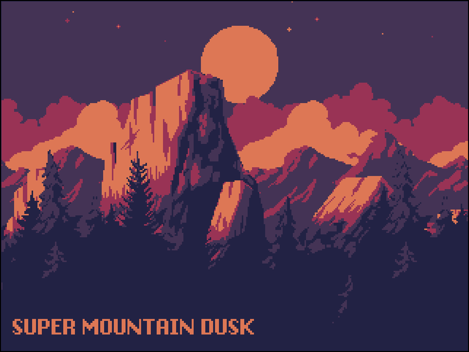
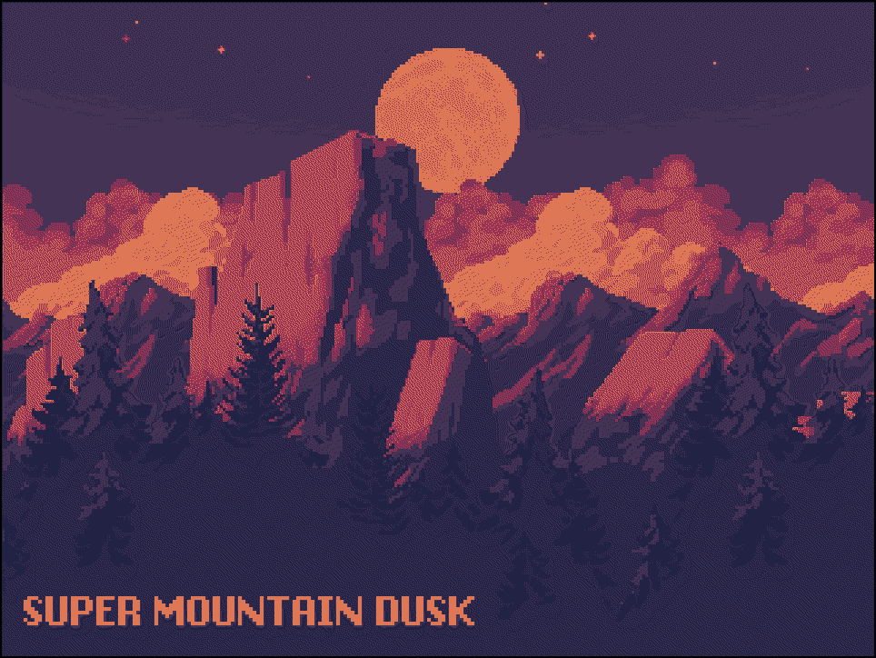
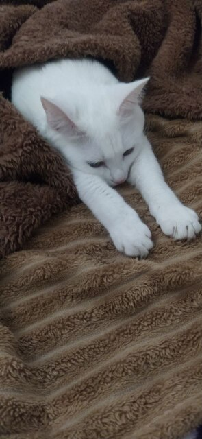
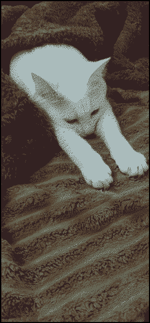

I'm not much of an artist or a photographer, so here are some Creative Commons-licensed assets.

## Autumn landscape 

| [Original](https://commons.wikimedia.org/wiki/Category:Landscapes_of_Ukraine#/media/File:Затишний_осінній_ранок.jpg) | Median cut algorithm + dither | Red/Green/DarkBlue/White palette + dither |
| -------- | ----------------------------- | ----------------------- |
|  |  |  |

## Mountain Dusk parallax background by ansimuz

| [Original](https://ansimuz.itch.io/mountain-dusk-parallax-background) | Median cut algorithm | Median cut algorithm + dither |
| -------- | ----------------------------- | ----------------------- |
|  |  |  |

## Cat

Also, here's my cat.

| Original | Median cut algorithm + dither |
| -------- | ----------------------------- |
|  |  |
